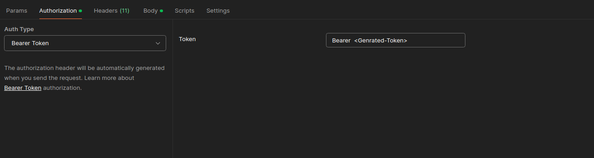

# RBAC-Using-JWT

This project demonstrates how to implement JWT (JSON Web Token) based authentication and authorization using Spring Security. It includes different user roles (Admin and Employee) and public endpoints for accessing secured resources.

## Project Structure

``` sh 
.
├── mvnw
├── mvnw.cmd
├── pom.xml
├── README.md
└── src
    ├── main
    │   ├── java
    │   │   └── com
    │   │       └── harsh
    │   │           └── JWTLearnings
    │   │               ├── Controller
    │   │               │   ├── PublicController.java
    │   │               │   └── UserController.java
    │   │               ├── dto
    │   │               │   └── LoginRequest.java
    │   │               ├── Entity
    │   │               │   └── UserEntity.java
    │   │               ├── exception
    │   │               │   └── GlobalExceptionHandler.java
    │   │               ├── JwtBasedSpringSecurityApplication.java
    │   │               ├── Repository
    │   │               │   └── UserRepo.java
    │   │               ├── Security
    │   │               │   ├── AuthEntryPointJwt.java
    │   │               │   ├── AuthTokenFilter.java
    │   │               │   ├── JWTUtils.java
    │   │               │   ├── SecurityConfig.java
    │   │               │   └── UserDetailsServiceImp.java
    │   │               └── Service
    │   │                   ├── PublicService.java
    │   │                   └── UserService.java
    │   └── resources
    │       └── application.yml

```


## Key Components

### 1. **Controllers**
- `UserController.java`:Manages endpoints for user-specific actions (profile, updates, etc.).
- `PublicController.java`: Handles public endpoints accessible without authentication.

### 2. **DTO**
- `LoginRequest.java`: Represents the request structure for login actions.


### 3. **Entities**
- `UserEntity.java`: Represents the user entity in the application, including fields like email, password, and roles.
### 4. **Exception Handling**
- `GlobalExceptionHandler.java`: Centralized exception handler for managing errors across the application.

### 5. **Security**
- `AuthEntryPointJwt.java`:  Handles unauthorized access attempts and customizes error messages.
- `AuthTokenFilter.java`: ntercepts requests and validates JWT tokens.
- `JWTUtils.java`: Utility class for generating, parsing, and validating JWT tokens.
- `SecurityConfig.java`: Configures Spring Security, roles, and JWT authentication..
- `UserDetailsServiceImp.java`: Custom implementation of UserDetailsService for loading user-specific data during authentication.

### 6. **Repositories**
- `UserRepo.java`: Data access layer for interacting with the user database.

### 7. **Services**
  - `PublicService.java`: Provides business logic for public actions.
  - `UserService.java`: Manages business logic for user-specific actions (profile, update, delete, etc.).


## **Endpoints**
 - ### Public Endpoints (No Authentication Required)

    - `/register/`: Allows new users to register.
    - `/login/`: Authenticates users and provides a JWT token.
-  ### User-Specific Endpoints (Authentication Required)
    - `GET /profile`: Retrieves the profile details of the logged-in user.
    - `PUT /update`: Updates the profile details of the logged-in user.
    - `DELETE /delete-self`: Allows an authenticated user to delete their account.


- ### Admin-Specific Endpoints (Admin Authentication Required)

    - `GET /all-users`: Retrieves all user details (admin-only).
    - `DELETE /delete/{email}`: Deletes a user by their email address (admin-only).
## Configuration
Before running the application, you need to configure the application.yml file with your database and other environment settings. Below is the configuration section you need to adjust:

``` sh 

    spring:
        application:
            name: RBAC-Using-JWT

        datasource:
            url: jdbc:mysql://localhost:3306/JWTLearnings?createDatabaseIfNotExist=true
            username: <username>   # Update with your database username
            password: <password>  # Update with your database password
    
        jpa:
            hibernate:
                ddl-auto: update  # Set to 'validate', 'update', 'create', or 'create-drop' based on your environment

        profiles:
            active: dev  # Change to 'prod' or 'test' based on your active profile

    server:
        servlet:
            context-path: /user  # Adjust this path as needed based on your application setup

```

## Running the Application

1. Clone the repository:

   ```bash
   git clone https://github.com/Harshyadav02/RBAC-Using-JWT.git
   cd RBAC-Using-JWT
   ```

2. Build and run the application using Maven: `` ./mvnw spring-boot:run``
3. The application will start on ``http://localhost:8080/user/``.
**Note - /user is the context-path**

## **What after login** 
- Once you log in and receive the JWT token, follow these steps to access protected resources:

- Copy the JWT token that you received after successful login.
- Go to the Authorization section of your HTTP client (such as Postman or Insomnia).
- Select Authorization Type as Bearer Token.
- Add **Bearer** prefix and Paste the JWT token into the provided field.
- After this, you will be able to access the endpoints that require authentication by including your JWT token in the 



## Contribution

Feel free to fork the repository and submit a pull request with your changes. For major updates, please open an issue to discuss before implementing.
